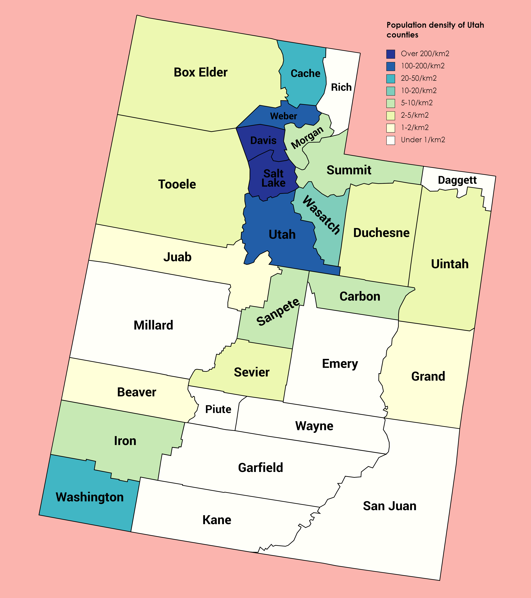

## Introduction

### Background

Utah is a deeply red state—over 50% of Utah voters are registered as Republicans or lean to the right, and Utah hasn’t elected a Democratic Senator in over fifty years. But in 2022, Utah was home to one of the most unique—and surprisingly competitive—Senate races in U.S. history.

In Utah’s 2022 Senate election, there was no democratic candidate at all. The Utah Democratic party voted not to endorse a nominee and instead threw their support behind independent candidate Evan McMullin. Utah Democrats hoped McMullin would stand a higher chance at defeating incumbent Senator Mike Lee, whom many Utahns had grown dissatisfied with for his strong support of Donald Trump and role in seeking to overturn the 2020 Presidential election. McMullin drew a wide coalition of support from Utah Democrats, independents, and anti-Trump Republicans.

Lee ultimately won the election, but it was Utah’s most competitive Senate race since 1976. Utah’s 2022 Senate election has cast into question how safely partisan states like Utah really are and has given U.S. minority coalitions a potential new electoral strategy.

### Research question and hypothesis

How are Utah counties’ population densities correlated with their support for McMullin in 2022?

I hypothesize that Utah counties’ population densities share a positive correlation with those counties’ support for Evan McMullin in the 2022 Senate race. Urban areas are generally more liberal than rural areas, and support for McMullin tended to be higher among liberal Utahns than it was among conservative Utahns (because the Utah Democratic party encouraged its voters to support McMullin, and because McMullin’s opponent was a Republican).

Because McMullin drew support from across party lines, it is hard to predict support for him based solely on partisan data. Looking at population density instead could help provide a more nuanced view of where candidates like McMullin are likely to find support—not only from strict Democrats or Republicans, but also from independents or conventional party members with uncommon leanings. Party coalitions in states like Alaska are already looking at applying McMullin’s strategy (fielding an independent instead of a major-party candidate) in future elections. Analyzing where people like McMullin draw their support from will be important when assessing whether this strategy will be electorally viable in the future, and will be vital to geographic allocations of ad money and campaign events if others do decide to emulate McMullin.

## Data

### Datasets

This project relies on two datasets, one showing 2022 Senate election results and one showing Utah counties’ population densities. My election results dataset is drawn from the MIT Elections Lab. Their dataset initially displayed all 2022 Senate votes by county for each U.S. state, but I filtered the dataset down to only Utah counties, then filtered the candidates down to only McMullin and Lee (so excluding write-ins and other fringe candidates). I also created a tibble called `percentage_votes` that shows what percent of the total Lee/McMullin votes by county went to Lee, and what percent went to McMullin. My population density dataset is drawn from USA.com, which sources its data from the 2020 U.S. Census. I added this data into my election results dataset by creating a new tibble called `population_density.`

```{r}
## PRELIMINARY DATA WORK

# Load packages
library(tidyverse)
library(dplyr)

# Load CSV
senate_data <- read_csv("senate_2022.csv")

# Filter the data for Utah
utah_data <- senate_data |>
  filter(state_po == "UT")

# Create a dataset that only shows votes for Lee and McMullin
lee_mcmullin <- utah_data |>
  filter(candidate == "EVAN MCMULLIN" | candidate == "MIKE LEE")

# Create a data frame with population density information
population_density <- tibble(
  county_name = c("SALT LAKE", "DAVIS", "WEBER", "UTAH", "CACHE", 
                  "WASHINGTON", "WASATCH", "SUMMIT", "SANPETE", "MORGAN", 
                  "CARBON", "IRON", "SEVIER", "TOOELE", "UINTAH", "BOX ELDER",
                  "DUCHESNE", "JUAB", "GRAND", "BEAVER", "PIUTE", "EMERY",
                  "RICH", "SAN JUAN", "MILLARD", "KANE", "WAYNE", "DAGGETT", "GARFIELD"),
  density = c(1317.5, 501.0, 358.4, 252.1, 98.9, 59.6, 21.2, 20.1, 17.6, 16.3,
              14.2, 14.2, 10.8, 8.2, 7.7, 7.5, 6.0, 3.0, 2.5, 2.5, 2.5, 2.4, 
              2.1, 1.9, 1.8, 1.8, 1.1, 1.0, 1.0))

# Join the population density data with the original dataset
lee_mcmullin_density <- lee_mcmullin |>
  inner_join(population_density, by = "county_name")

# Summarize total votes by county and candidate
votes_by_candidate <- lee_mcmullin |>
  group_by(county_name, candidate) |>
  summarize(total_votes = sum(candidatevotes))

# Calculate total votes by county
total_votes_by_county <- votes_by_candidate |>
  group_by(county_name) |>
  summarize(total_votes_county = sum(total_votes))

# Join the data back and calculate percentage
percentage_votes <- votes_by_candidate |>
  inner_join(total_votes_by_county, by = "county_name") |>
  mutate(percentage = (total_votes / total_votes_county) * 100)

# Troubleshooting - join population_density with percentage_votes
percentage_votes_with_density <- percentage_votes |>
  left_join(population_density, by = "county_name")
```
### Explanatory Variable

In this project, my explanatory variable is Utah counties’ population densities (measured in people per sq. mile).



```{r}
library(stringr)

# Convert county names to title case, re-factor, update color_index
population_density$county_name <- str_to_title(population_density$county_name)
population_density$county_name <- factor(population_density$county_name, levels = population_density$county_name[order(population_density$density, decreasing = TRUE)])
population_density$color_index <- as.numeric(population_density$county_name)

# Chart population density by county
ggplot(population_density, aes(x = county_name, y = density, fill = color_index)) +
  geom_bar(stat = "identity") +
  scale_y_log10() +
  scale_fill_gradientn(colors = rainbow(n = length(unique(population_density$county_name)))) + # Custom gradient color scale
  theme_minimal() +
  labs(title = "Population Density by County in Utah",
       x = "County",
       y = "Population Density (per sq. mile, log scale)") +
  theme(axis.text.x = element_text(angle = 45, hjust = 1),
        legend.title = element_blank(),
        legend.position = "none")
```

### Outcome Variable

My outcome variable is Utah counties’ support for Evan McMullin in the 2022 election (measured as the % of each county’s votes that were cast for McMullin, out of each county’s aggregate total # of votes for both Lee and McMullin).

```{r}
# Convert county/candidate names to title case
lee_mcmullin$county_name <- str_to_title(lee_mcmullin$county_name)
lee_mcmullin$candidate <- str_to_title(lee_mcmullin$candidate)

# Graphing votes for Lee and McMullin
ggplot(lee_mcmullin, aes(x = county_name, y = candidatevotes, fill = candidate)) +
  geom_bar(stat = "identity", position = "dodge") +
  scale_y_log10() +
  scale_fill_manual(values = c("Mike Lee" = "firebrick", "Evan Mcmullin" = "steelblue")) +
  theme_minimal() +
  labs(title = "Votes by UT County for Lee and McMullin",
       x = "County",
       y = "Number of Votes (log scale)",
       fill = "Candidate") +
  theme(axis.text.x = element_text(angle = 45, hjust = 1))
```


```{r}
## % OF VOTES FOR MCMULLIN BY COUNTY

# Filter to McMullin
mcmullin_data <- percentage_votes_with_density |>
  filter(candidate == "EVAN MCMULLIN")

# Convert county/candidate names to title case
mcmullin_data$county_name <- str_to_title(mcmullin_data$county_name)

# Graph for Evan McMullin votes by county with updated text
ggplot(mcmullin_data, aes(x = reorder(county_name, density), y = percentage, fill = candidate)) +
  geom_bar(stat = "identity", position = "dodge") +
  scale_fill_manual(values = c("EVAN MCMULLIN" = "steelblue")) +
  theme_minimal() +
  labs(title = "% of Votes for McMullin, by UT County",
       x = "County (Ordered by Population Density, Lowest to Highest)",
       y = "Percentage of Votes") +
  theme(axis.text.x = element_text(angle = 45, hjust = 1), legend.position = "none")
```
I seek to assess the correlation between these two variables and analyze whether population density can be used as a predictor for support for McMullin. My research design is observational, correlational analysis—I do not seek to make any claims about causation.

## Results

### Final Plot
```{r}
## POP DENSITY V MCMULLIN VOTES SCATTERPLOT

# Create a scatter plot with a logarithmic x-axis and a confidence interval for the line of best fit
ggplot(mcmullin_data, aes(x = density, y = percentage)) +
  geom_point(aes(color = county_name), size = 3) +
  geom_smooth(method = "lm", se = TRUE, color = "blue") +
  scale_x_log10() +
  theme_minimal() +
  labs(title = "% of Votes for McMullin by Pop. Density",
       x = "Population Density (Log scale)",
       y = "Percentage of Votes",
       color = "County") + # Legend title for counties
  theme(axis.text.x = element_text(angle = 45, hjust = 1))
```
I used a scatterplot to visualize the relationship between Utah counties’ population densities and their percentage support for McMullin in the 2022 election. I imposed a regression line and confidence interval over this scatterplot. The plot supports my hypothesis that there is a positive relationship between Utah counties’ population densities and their support for McMullin. Its regression line shows a relatively pronounced positive correlation between the two variables.

### Regression
```{r}
## REGRESSION

library(broom)
library(modelsummary)

# Run the linear regression model
mcmullin_lm <- lm(percentage ~ log(density), data = mcmullin_data)

# Summary of the model
summary_mcmullin_lm <- summary(mcmullin_lm)
print(summary_mcmullin_lm)

# Create a table of results
var_labels <- c(
  "(Intercept)" = "Intercept",
  "log(density)" = "Pop. Density (Log)")

modelsummary::modelsummary(
  mcmullin_lm,
  statistic = c("s.e. = {std.error}", "p = {p.value}"),
  coef_map = var_labels,
  gof_map = c("nobs", "r.squared", "adj.r.squared"))

```

To further assess the significance of this relationship, I ran a regression (results displayed in the table above).

The coefficient for the intercept, 19.867, is the expected value of the outcome variable (% of votes for McMullin when the explanatory variable (population density) is equal to 1 person/sq. mile. This intercept has a standard error of 3.498, and a very small p-value (less than 0.001). Because this p-value is less than 0.05, we can reject the null hypothesis that the intercept is zero, and be very confident that there will likely be at least some support for McMullin even in Utah counties with very low population density.

The coefficient for population density (4.006) indicates that for each 1-unit increase in the log of population density, we can expect a county’s % of votes for McMullin to increase by about 4.006 percentage points. This coefficient has a standard error of 1.148 and a p-value of 0.002. Because this p-value is less than 0.05, we can reject the null hypothesis that there is no correlation between population density and % support for McMullin.

In sum, this graph and regression indicate that there is a statistically significant, positive correlation between the population density of a Utah county (seen here in log form) and the percentage of votes that McMullin received in that county.

Though there is a correlation between these two variables, we cannot assume causation. There could be many confounding variables (for example, more densely populated counties may have more places to vote, campaigning may not have been evenly distributed across the state, or these statistics could have been skewed by the fact that Democrats are both 1) more likely to live in densely populated areas, and 2) more likely to support McMullin). While this analysis establishes a correlation, we do not have enough data to speculate about a causal relationship between these two variables.

## Conclusion

There appears to be a moderate positive relationship between a Utah county’s population density and that county’s percentage support for Evan McMullin in Utah’s 2022 Senate race. This relationship appears statistically significant, affirming my hypothesis.

This analysis is limited because it does not look at the scope of all votes, just those for Lee and McMullin. It would have been difficult for me to plot and analyze election data if all write-ins and non-McMullin third-party votes were included, so I simplified the dataset to just include votes for Lee and McMullin. However, this leaves out some of the election results. Right now, votes that did not go to McMullin are assumed to have gone to Lee, when in fact some of them may have gone to more fringe candidates. If I had more time, I would factor in write-in and non-McMullin third-party votes to my analysis (perhaps by creating a third category, to encompass all non-Lee or McMullin votes).


Additionally, the observed positive relationship between population density and support for McMullin may be confounded by factors such as the proportional presence of Democratic voters in a county, or by the number of nearby voting stations (though Utah has some of the best mail-in voting in the U.S., so this may be less of a confounder here than in other states). If I were to perform this analysis again, I would look for ways to factor in data on party affiliation and access to voting in order to clear out confounding noise that may be affecting my relationship of interest.

## Sources

Everett, Burgess. “Welcome to the Strangest Senate Race in America.” POLITICO, 8 Aug. 2022, www.politico.com/news/2022/08/08/utah-strangest-senate-race-in-america-00050090. 

MIT Election Data and Science Lab. “U.S. Senate County-Level Results 2022.” Harvard Dataverse, Harvard Dataverse, 20 Sept. 2023, dataverse.harvard.edu/dataset.xhtml?persistentId=doi%3A10.7910%2FDVN%2FYB60EJ. 

Stern, Emily Anderson. “Utah Sen. Mike Lee Wins Reelection, Beating Independent Challenger Evan McMullin in Unprecedented Senate Race.” The Salt Lake Tribune, The Salt Lake Tribune, 9 Nov. 2022, www.sltrib.com/news/politics/2022/11/08/incumbent-mike-lee-pulls-ahead/. 

USA.com. “Utah Population Density County Rank.” USA.Com, 2022, www.usa.com/rank/utah-state--population-density--county-rank.htm. 
“Utah Population Density.” Wikimedia Commons, Wikimedia Commons, 2020, commons.wikimedia.org/wiki/File:Population_density.png. 

“Utah U.S. Senate Election Results.” The New York Times, The New York Times, 8 Nov. 2022, www.nytimes.com/interactive/2022/11/08/us/elections/results-utah-us-senate.html. 
```

